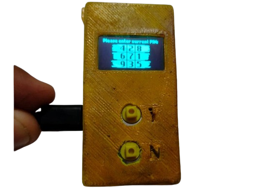
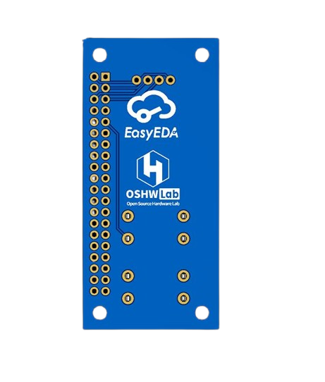
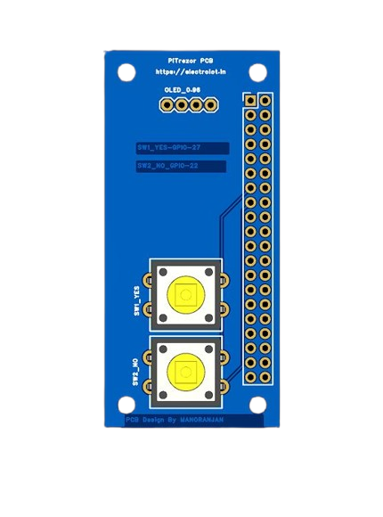

# 🔐 Raspberry Pi Zero – PiTrezor Hardware Bitcoin Wallet

 <!-- Replace with actual image path -->

  &nbsp;&nbsp;&nbsp;&nbsp;&nbsp;&nbsp;&nbsp;
  

## 🧠 Project Original Firmware Idea 
[PiTrezor Original Link](https://www.pitrezor.com/2018/02/pitrezor-homemade-trezor-bitcoin-wallet.html)  

## 🧠 Project PCB Overview

**PiTrezor** is a DIY open-source hardware wallet built using a **Raspberry Pi Zero**, enabling secure offline storage and transaction of cryptocurrencies like Bitcoin. It features a physical two-button interface, an OLED display for verification, and runs **Trezor-compatible firmware**.

> ⚠️ This is an experimental, community-based clone of Trezor. Not for production-scale crypto storage unless you fully understand the risks.

---

## 📦 Features

- 🔐 **Offline Cold Wallet** – All signing is done locally, never exposing private keys  
- 📲 **Two-button interface** for secure confirmations  
- 📺 **OLED display** to verify transactions  
- 🧩 **Open-source firmware** using Trezor stack  
- 💾 **MicroSD-based OS**, easy to flash  
- 🔌 Micro USB powered, ultra-portable  
- 🛠️ Custom-designed PCB for compact layout

---

## 🧰 Hardware Requirements

| Component            | Description                  |
|----------------------|------------------------------|
| Raspberry Pi Zero    | or Pi Zero W                 |
| OLED Display         | 0.96" I2C/SPI (SSD1306)      |
| Tactile Push Buttons | 2 × 12x12mm                  |
| MicroSD Card         | 8GB+ for Pi OS               |
| Custom PCB           | Designed in EasyEDA         |
| Micro USB Cable      | Power & data                 |

---

## ⚙️ Software & Firmware

- 🔧 [Trezor Firmware (GitHub) yocto-pitrezor](https://github.com/heneault/yocto-pitrezor)  
- 🧑‍💻 [PiTrezor Setup Guide](https://www.pitrezor.com/2018/02/pitrezor-homemade-trezor-bitcoin-wallet.html)  
- 🌐 [Trezor Web Wallet](https://wallet.trezor.io/)

---

## 💽 How to Flash the Firmware

1. 📥 **Download PiTrezor Image**  
   From: [PiTrezor Official Guide](https://www.pitrezor.com/2018/02/pitrezor-homemade-trezor-bitcoin-wallet.html)

2. 🖥️ **Flash to MicroSD**  
   Use [Balena Etcher](https://etcher.io/) or Raspberry Pi Imager to flash the `.img` file.

3. 🧩 **Assemble Hardware**  
   - Connect OLED to Pi GPIO (as per `RPI.pdf`)  
   - Connect buttons to GPIOs and GND

4. 🔌 **Power the Pi**  
   Plug into USB power and let it boot.

5. 🔐 **Access Web Interface**  
   Open [wallet.trezor.io](https://wallet.trezor.io/) and follow instructions.

---

## ⚠️ Security Warning

> ❗ This project is **for experimental or educational use only**.  
> Do NOT store large amounts of crypto on this device unless you fully understand the risks.

- No guarantee of security or maintenance
- Do not use this on untrusted computers
- This is not affiliated with SatoshiLabs or the official Trezor team

---

## 🧾 Protect Your Seed

> 🛑 **Your recovery seed is your wallet.**

- Never save it digitally  
- Write it down physically  
- Store in a secure, fireproof location  
- Anyone with your seed can steal your funds

---

## 📐 PCB Design

This repo includes:
- ✅ `RPI.pdf` – GPIO pinout and schematic
- ✅ Gerber files (optional)
- ✅ EasyEDA project link (if public)

---

## 🙏 Credits

- 💡 Original Idea: [Dmitry Nedospasov – PiTrezor](https://www.pitrezor.com/2018/02/pitrezor-homemade-trezor-bitcoin-wallet.html)  
- 🔧 Firmware: [Trezor Firmware](https://github.com/heneault/yocto-pitrezor)  
- 💻 Web Wallet: [https://wallet.trezor.io](https://wallet.trezor.io)

---

## 📜 License

This project is open-source under the [MIT License](LICENSE).  
Use at your own risk. Not for commercial use without permission.

---

## 🙏 Special Thanks

A big thank you to the following platforms for their amazing tools and support in designing this open-source hardware project:

  &nbsp;&nbsp;&nbsp;&nbsp;&nbsp;&nbsp;&nbsp;
  

- **[EasyEDA](https://easyeda.com/)** – for their powerful PCB design tools  
- **[OSHWLab](https://oshwlab.com/)** – for hosting open-source hardware projects

Their platforms made this project possible and easy to share with the maker community ❤️

## 📬 License

Open Source Hardware — OSHWA Certified

---

Happy Making! 💡# Raspberry-Pi-Zero-PiTrezor-Hardware-Bitcoin-Wallet-PCB
